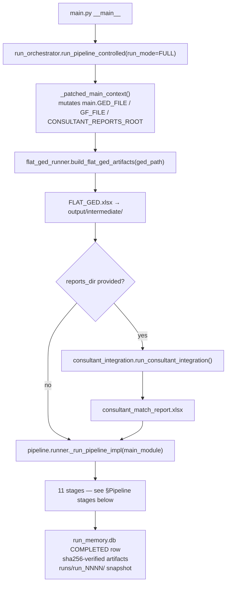
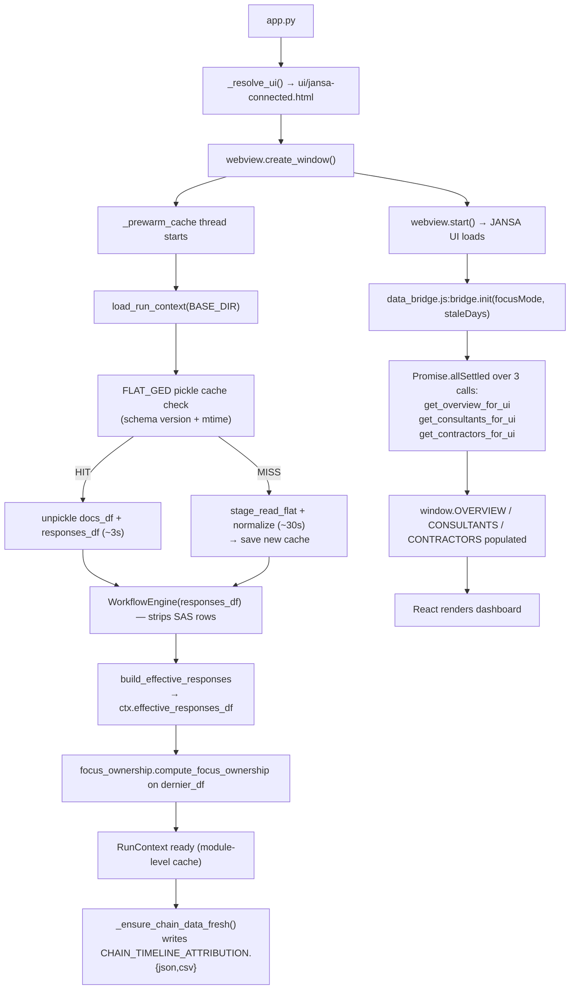
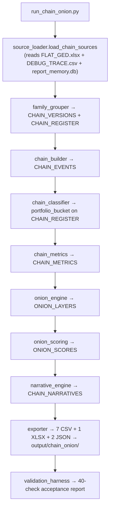

#repo-map #execution-flow #pipeline #runtime

# Execution Flow

> What happens step-by-step when you run the two entrypoints.
> See [[04_PIPELINE_STAGES]] for per-stage detail, [[06_JANSA_UI_RUNTIME]] for UI detail.

---

## `python main.py`

Key points:
- `main.py` is intentionally tiny — delegates immediately to `run_orchestrator`
- `_patched_main_context` mutates path globals on the `main` module namespace; restored in `finally`
- `pipeline.runner._run_pipeline_impl` reads paths from `sys.modules["main"]`, NOT from `pipeline.paths`
- On any exception: `finalize_run_failure` marks the run row as FAILED in `run_memory.db`

---

## `python app.py`

Key points:
- `app._resolve_ui()` raises `FileNotFoundError` if `ui/jansa-connected.html` is missing — no fallback
- `--browser` mode: same HTML opens in system browser, but `window.pywebview.api` is unavailable; `data_bridge.js` times out after 5s and renders placeholder data only
- `RunContext` is cached at module level; cleared by `clear_cache()` after a new pipeline run

---

## `python run_chain_onion.py`

This is an **independent runner** — separate from the main pipeline.

Key coupling: Chain+Onion reads `output/intermediate/*` directly (NOT `run_memory.db`). It is coupled to "the most recent run that wrote intermediate", not to a specific `run_number`.

---

## Execution mode selection (orchestrator)

The orchestrator supports four modes based on what files are provided:

| Mode | Inputs | GF resolution |
|---|---|---|
| `GED_ONLY` | GED only | Inherited from latest valid completed run, or Run 0 |
| `GED_GF` | GED + GF | Provided directly |
| `GED_REPORT` | GED + reports | GF inherited |
| `FULL` | GED + reports + GF | Direct or inherited |

Inherited GF fallback order:
1. Latest completed non-stale run with a valid `FINAL_GF` artifact
2. Run 0 `FINAL_GF`
3. Clear failure if neither exists

---

## What `GFUP_FORCE_RAW=1` does

Setting this env variable forces `stage_read` (raw GED path) instead of `stage_read_flat` (default flat path). This is a developer fallback only — the raw path has more schema drift risk. Do not use in production.

---

*Back to [[00_START_HERE]]*
