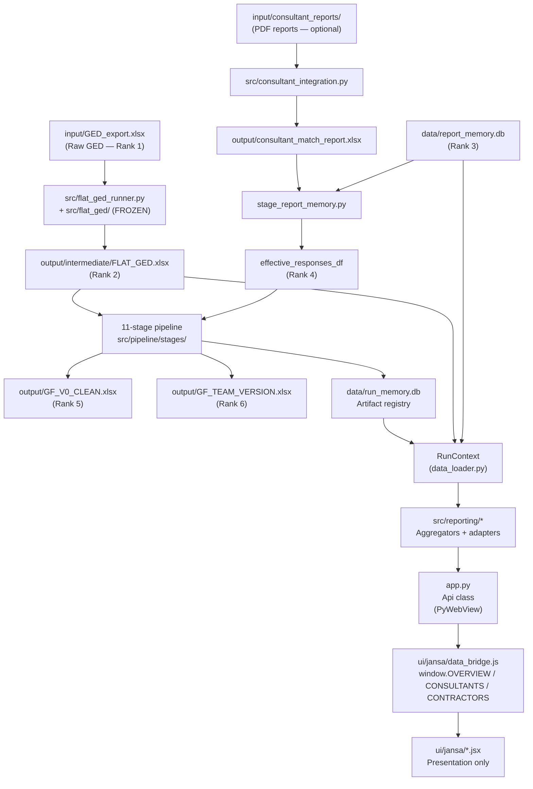
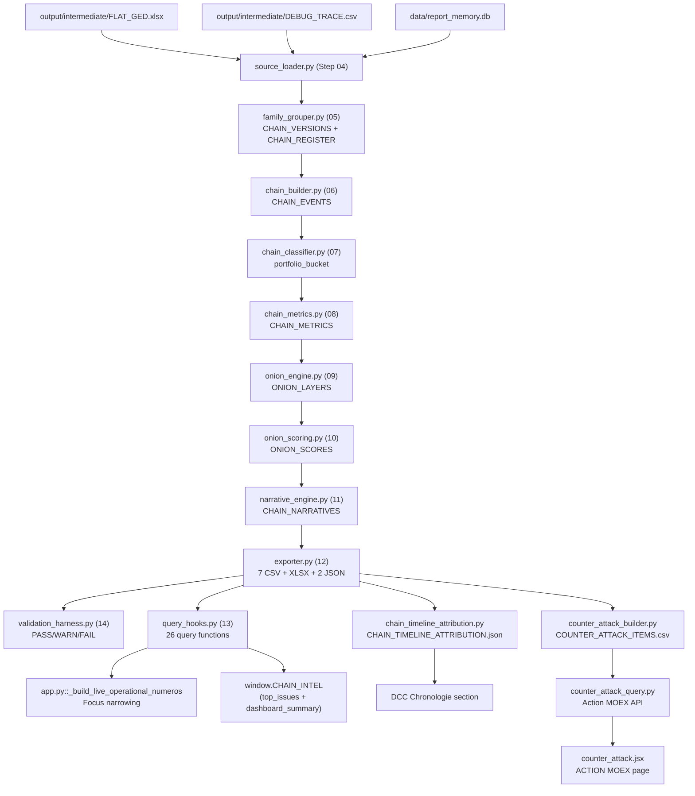
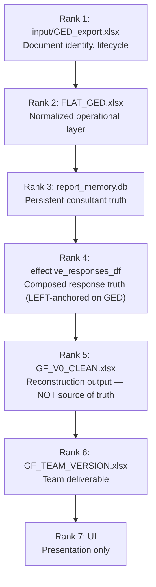
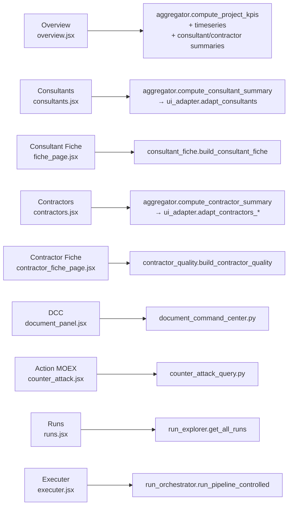
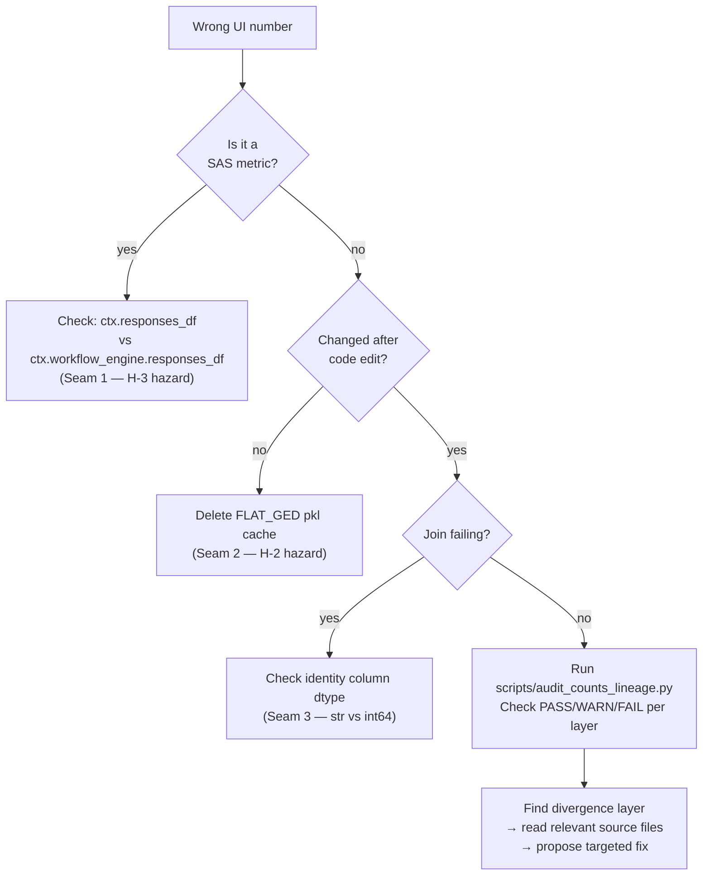

#repo-map #graph #mermaid #data-flow

# System Graph

> Mermaid graphs of major modules and data flows.

---

## Full system data flow



---

## Chain+Onion data flow



---

## Source-of-truth hierarchy



---

## Pipeline stage sequence

```mermaid
flowchart LR
    S1[stage_init_run] --> S2[stage_read_flat]
    S2 --> S3[stage_normalize]
    S3 --> S4[stage_version]
    S4 --> S5[stage_route]
    S5 --> S6[stage_report_memory]
    S6 --> S7[stage_write_gf]
    S7 --> S8[stage_build_team_version]
    S8 --> S9[stage_discrepancy]
    S9 --> S10[stage_diagnosis]
    S10 --> S11[stage_finalize_run]
```



---

## UI screen → backend module mapping



---

## Debugging flow (where to look first)



---

*Back to [[00_START_HERE]]*
```
